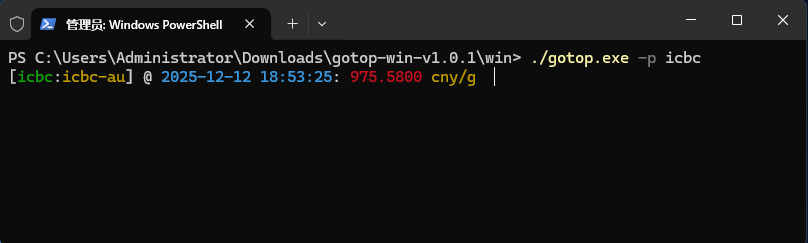
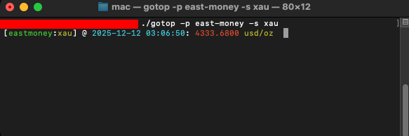

gotop-cli
=========

A terminal tool to show price of gold, silver, forex...

## Usage

```bash
# platform sina, symbol: xau|xag|autd|agtd|xaucny|xagcny|usdidx
./gotop -p sina -s xau
# platform east-moeny, symbol: xau|xag|autd|mautd|agtd
./gotop -p east-money -s autd
# platform itick, symbol: xau|xag|xaucny|usd2cnh 已废弃
./gotop -p itick -s usd2cnh
# platform cmb, symbol: cmb-au [招行黄金活期]|usd2cny [招行外汇人民币汇率]
./gotop -p cmb -s cmb-au
./gotop -p cmb -s usd2cny
# platform cmbc, symbol: cmbc-au [民生银行积存金（京东金融代销）]
./gotop -p cmbc
# platform icbc, symbol: icbc-au [工行积存金]
./gotop -p icbc
```

## Installation

### Quick Install (Recommended)

**One-line install for Linux/macOS:**

```bash
curl -fsSL https://raw.githubusercontent.com/ycrao/gotop-cli/main/install.sh | bash
```

### Manual Install

1. Download the appropriate file from [Releases](https://github.com/ycrao/gotop-cli/releases/latest):

   - Linux: `gotop-linux-*.tar.gz`
   - macOS (Intel): `gotop-mac-*.tar.gz`
   - macOS (ARM64): `gotop-mac-arm64-*.tar.gz`
   - Windows: `gotop-windows-*.zip`

2. Extract and install:

   ```bash
   tar -xzf gotop-*.tar.gz
   sudo cp */gotop /usr/local/bin/
   ```

## Screenshots




